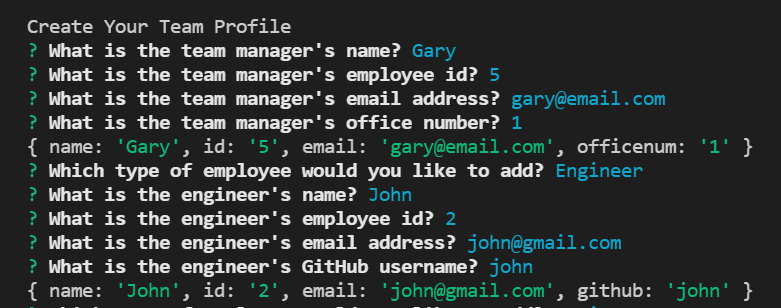
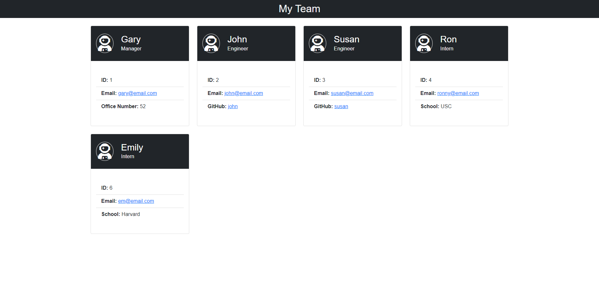

# Team Profile Generator
 

## Description

A command-line application that takes in information about employees on a software engineering team, then generates an HTML webpage that displays summaries for each person.

## Table of Contents
* [Description](#description)
* [Installation](#installation)
* [Usage](#usage)
* [License](#license)
* [Tests](#tests)
* [Questions](#questions)

<br>

## Installation

* To use this application, you need to have Node.js installed.

* Install the [Inquirer package](https://www.npmjs.com/package/inquirer) in the project folder by entering the following command in your terminal: <br> ```npm i inquirer``` <br> 

<br>

## Usage
* Run the application in your teminal by entering the following command: <br>
```node index.js``` 
<br>

* You will be presented with a series of questions about your software engineering team.

<p align="center">
    
</p>
<br>

* After adding all team members and answering all prompt questions, an HTML file of the Team Profile will automatically be generated.

<br>
<p align="center">
    <i>Sample Generated HTML page of Team Profile</i>
</p>
<br>

<p align="center">
    
</p>
<br>

<p align="center">
    <i>Walkthrough video</i>
</p>
<br>


## License
This code is licensed under [MIT License](https://mit-license.org/).

<br>

## Tests
To run tests, install the [Jest testing package](https://www.npmjs.com/package/jest) in the project folder by entering the following command in your terminal: <br> ```npm i -d jest``` <br> 
<br>

Start running the tests by entering the following command: <br>
```npm test``` 
<br>


https://user-images.githubusercontent.com/97539424/160731098-cf34535f-bbb9-42ed-8564-c3c7f7051ed3.mp4

<br>
<hr>

## Questions
If you have any questions, please don't hesitate to contact:
 * Github - [github.com/nvsco-10](https://github.com/nvsco-10)
 * Email - neemavelasco@gmail.com
